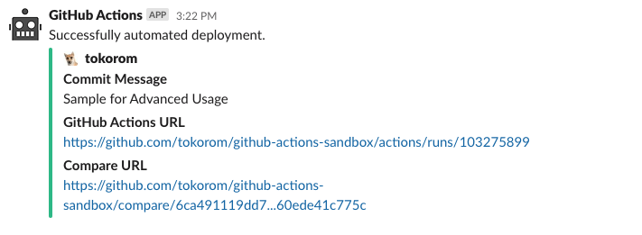

<p align="center">
  <a href="https://github.com/actions/javascript-action/actions"></a>
</p>

# GitHub Action for Slack Incoming Webhook

## Feature

- Send a message using Incoming Webhooks on Slack App
    - Don't use legacy incoming Webhooks on custom integrations
- You can use the names of the fields in the Message payloads provided by Slack
    - https://api.slack.com/reference/messaging/payload
    - https://app.slack.com/block-kit-builder (Sign in needed)

## Simple Usage

```yaml
- name: Slack Notification
  uses: tokorom/action-slack-incoming-webhook@main
  env:
    INCOMING_WEBHOOK_URL: ${{ secrets.SLACK_WEBHOOK_URL }}
  with:
    text: Hello, Slack!
```

Here's what the Slack message would look like:


## Advanced Usages

- You can flexibly specify `attachments` and `blocks`
    - https://api.slack.com/reference/messaging/attachments
    - https://api.slack.com/reference/block-kit/blocks

```yaml
- name: Set COMMIT_MESSAGE
    run: echo "COMMIT_MESSAGE=${{ github.event.head_commit.message }}" | tr '\n' ' ' >> $GITHUB_ENV
- name: Slack Notification on SUCCESS
  if: success()
  uses: tokorom/action-slack-incoming-webhook@main
  env:
    INCOMING_WEBHOOK_URL: ${{ secrets.SLACK_WEBHOOK_URL }}
  with:
    text: Successfully automated deployment.
    attachments: |
      [
        {
          "color": "good",
          "author_name": "${{ github.actor }}",
          "author_icon": "${{ github.event.sender.avatar_url }}",
          "fields": [
            {
              "title": "Commit Message",
              "value": "${{ github.event.head_commit.message }}"
            },
            {
              "title": "GitHub Actions URL",
              "value": "${{ github.event.repository.url }}/actions/runs/${{ github.run_id }}"
            },
            {
              "title": "Compare URL",
              "value": "${{ github.event.compare }}"
            }
          ]
        }
      ]
```

Here's what the Slack message would look like:



## Change the icon

You can change the icon for a Slack message in the Slack App settings.

Slack's new Incoming Webhooks do not allow API payloads to override the icon.

- Open [Your Apps](https://api.slack.com/apps) page
- Select your app for Incoming Webhooks
- Select `Basic Information` > `Display Information`
- Set any icon you like!


